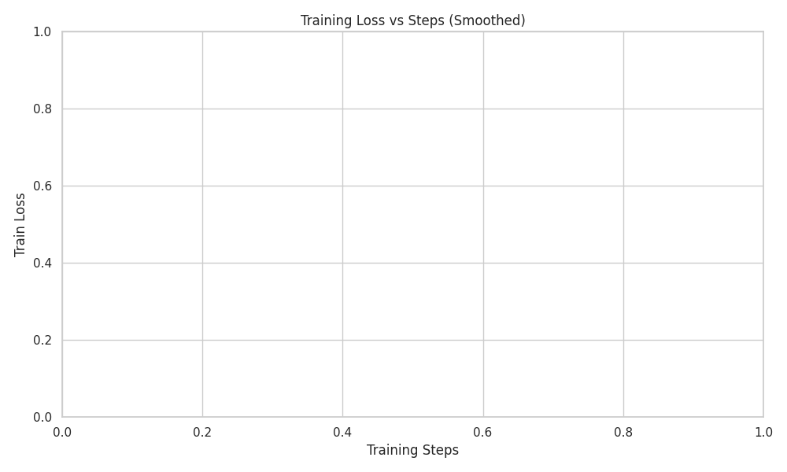

# Ablation Experiment Report

This report was automatically generated from Weights & Biases metrics.

## Top Performing Configurations

| Run ID   | Name         | Group        | Hypothesis                                                                                                                                                                                                                                                                                                    | Sweep ID   |   Learning Rate |   Batch Size |   Eval Loss | URL                                                    |
|:---------|:-------------|:-------------|:--------------------------------------------------------------------------------------------------------------------------------------------------------------------------------------------------------------------------------------------------------------------------------------------------------------|:-----------|----------------:|-------------:|------------:|:-------------------------------------------------------|
| 7omeutrj | dpo_training | dpo_baseline | Supervised Fine-Tuning (SFT) alone is insufficient to align the model to consistently ask clarification questions without hallucinating. A two-stage pipeline (SFT followed by DPO) will achieve a lower evaluation loss and better disambiguation formatting than either the SFT-only or DPO-only baselines. | N/A        |          5e-05  |            1 | 3.99771e-05 | https://wandb.ai/rl4aa/ask-before-answer/runs/7omeutrj |
| buzbquuo | dpo_training | dpo_baseline | Supervised Fine-Tuning (SFT) alone is insufficient to align the model to consistently ask clarification questions without hallucinating. A two-stage pipeline (SFT followed by DPO) will achieve a lower evaluation loss and better disambiguation formatting than either the SFT-only or DPO-only baselines. | N/A        |          5e-05  |            1 | 0.000113545 | https://wandb.ai/rl4aa/ask-before-answer/runs/buzbquuo |
| lln0thjk | sft_training | sft_baseline | Supervised Fine-Tuning (SFT) alone is insufficient to align the model to consistently ask clarification questions without hallucinating. A two-stage pipeline (SFT followed by DPO) will achieve a lower evaluation loss and better disambiguation formatting than either the SFT-only or DPO-only baselines. | N/A        |          0.0002 |            1 | 0.43139     | https://wandb.ai/rl4aa/ask-before-answer/runs/lln0thjk |
| nxep4c1i | sft_training | sft_baseline | Supervised Fine-Tuning (SFT) alone is insufficient to align the model to consistently ask clarification questions without hallucinating. A two-stage pipeline (SFT followed by DPO) will achieve a lower evaluation loss and better disambiguation formatting than either the SFT-only or DPO-only baselines. | N/A        |          0.0002 |            1 | 0.432052    | https://wandb.ai/rl4aa/ask-before-answer/runs/nxep4c1i |

## Learning Curves

