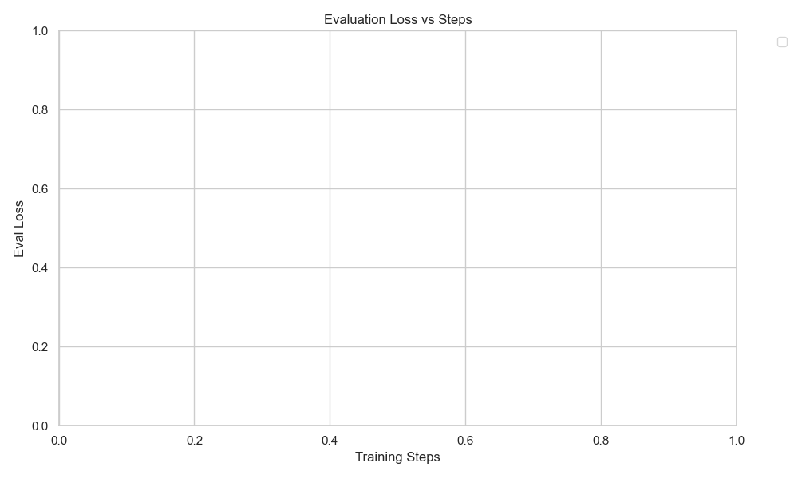

# Ablation Experiment Report

This report was automatically generated from Weights & Biases metrics.

## Top Performing Configurations

| Run ID   | Name         | Sweep ID   |   Learning Rate |   Batch Size |   Eval Loss | URL                                                    |
|:---------|:-------------|:-----------|----------------:|-------------:|------------:|:-------------------------------------------------------|
| 5cxs95q7 | sft_training | j6b6q65r   |     1.71876e-05 |            1 |    0.864485 | https://wandb.ai/rl4aa/ask-before-answer/runs/5cxs95q7 |

## Learning Curves

