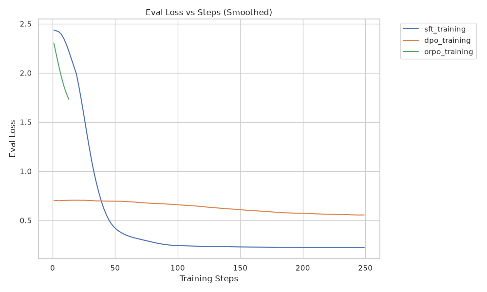
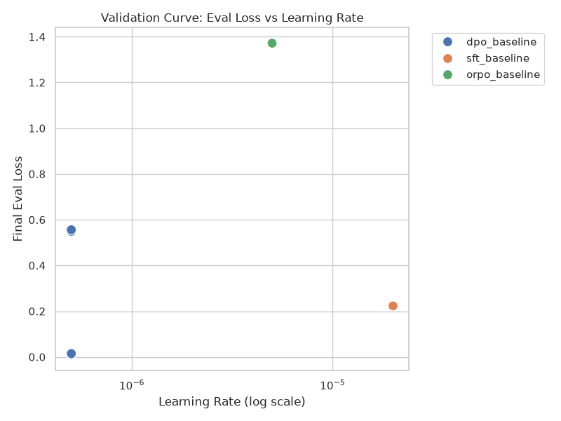

# Ablation Experiment Report

This report was automatically generated from Weights & Biases metrics.

## Top Performing Configurations

| Run ID   | Name          | Group         | Hypothesis   | Sweep ID   |   Learning Rate |   Batch Size |   Eval Loss | URL                                                    |
|:---------|:--------------|:--------------|:-------------|:-----------|----------------:|-------------:|------------:|:-------------------------------------------------------|
| bp50774y | dpo_training  | dpo_baseline  | N/A          | N/A        |           5e-07 |            1 |   0.0148286 | https://wandb.ai/rl4aa/ask-before-answer/runs/bp50774y |
| lduzpogd | sft_training  | sft_baseline  | N/A          | N/A        |           2e-05 |            1 |   0.223236  | https://wandb.ai/rl4aa/ask-before-answer/runs/lduzpogd |
| qgosp3j0 | dpo_training  | dpo_baseline  | N/A          | N/A        |           5e-07 |            1 |   0.549293  | https://wandb.ai/rl4aa/ask-before-answer/runs/qgosp3j0 |
| fl9cyvti | orpo_training | orpo_baseline | N/A          | N/A        |           5e-06 |            1 |   1.37168   | https://wandb.ai/rl4aa/ask-before-answer/runs/fl9cyvti |

## Learning Curves

## Validation Curves

## LLM-as-a-Judge Evaluation Leaderboard

The following scores were computed using W&B Weave 
with a Gemini-based judge scorer.

| Metric                |      base |   dpo_only |      sft |   sft_dpo |   clarifier_lora |     orpo |     grpo |
|:----------------------|----------:|-----------:|---------:|----------:|-----------------:|---------:|---------:|
| ambiguity_detection   | 0.966     |   0.974    | 0.97     |  0.946    |          0.994   | 0.968    | 0.952    |
| clarification_quality | 0.784     |   0.79     | 0.794    |  0.778    |          0.796   | 0.796    | 0.792    |
| usefulness            | 0.88      |   0.882    | 0.896    |  0.878    |          0.896   | 0.896    | 0.894    |
| model_accuracy        | 0.62      |   0.62     | 0.6      |  0.62     |          0.6     | 0.64     | 0.62     |
| clarify_precision     | 0.617021  |   0.617021 | 0.631579 |  0.657143 |          0.6     | 0.636364 | 0.634146 |
| clarify_recall        | 0.966667  |   0.966667 | 0.8      |  0.766667 |          1       | 0.933333 | 0.866667 |
| clarify_f1            | 0.753247  |   0.753247 | 0.705882 |  0.707692 |          0.75    | 0.756757 | 0.732394 |
| action_f1_answer      | 0.173913  |   0.173913 | 0.375    |  0.457143 |          0       | 0.307692 | 0.344828 |
| macro_f1              | 0.46358   |   0.46358  | 0.540441 |  0.582418 |          0.375   | 0.532225 | 0.538611 |
| answer_accuracy       | 0.05      |   0.05     | 0        |  0        |          0       | 0.1      | 0.1      |
| facet_generation_rate | 0.0851064 |   0.234043 | 1        |  1        |          0       | 0.977273 | 1        |
| clarify_ratio         | 1.56667   |   1.56667  | 1.26667  |  1.16667  |          1.66667 | 1.46667  | 1.36667  |

