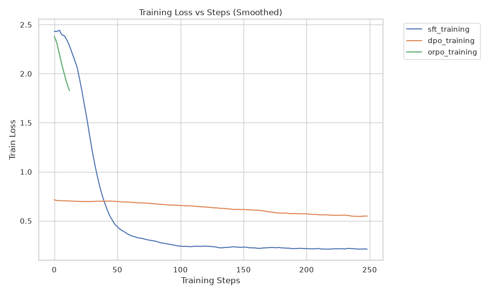

# Ablation Experiment Report

This report was automatically generated from Weights & Biases metrics.

## Top Performing Configurations

| Run ID   | Name          | Group         | Hypothesis   | Sweep ID   |   Learning Rate |   Batch Size |   Eval Loss | URL                                                    |
|:---------|:--------------|:--------------|:-------------|:-----------|----------------:|-------------:|------------:|:-------------------------------------------------------|
| amq3lj42 | sft_training  | sft_baseline  | N/A          | N/A        |           2e-05 |            1 |    0.223156 | https://wandb.ai/rl4aa/ask-before-answer/runs/amq3lj42 |
| 2om8x500 | dpo_training  | dpo_baseline  | N/A          | N/A        |           5e-07 |            1 |    0.344238 | https://wandb.ai/rl4aa/ask-before-answer/runs/2om8x500 |
| 5c1r1rmw | dpo_training  | dpo_baseline  | N/A          | N/A        |           5e-07 |            1 |    0.662823 | https://wandb.ai/rl4aa/ask-before-answer/runs/5c1r1rmw |
| xazqzfa1 | dpo_training  | dpo_baseline  | N/A          | N/A        |           5e-07 |            1 |    0.692516 | https://wandb.ai/rl4aa/ask-before-answer/runs/xazqzfa1 |
| tooh9928 | orpo_training | orpo_baseline | N/A          | N/A        |           5e-06 |            1 |    1.36939  | https://wandb.ai/rl4aa/ask-before-answer/runs/tooh9928 |

## Learning Curves

## LLM-as-a-Judge Evaluation Leaderboard

The following scores were computed using W&B Weave 
with a Gemini-based judge scorer.

| Metric                |      base |   dpo_only |      sft |   sft_dpo |   clarifier_lora |     orpo |      grpo |   grpo_dpo |
|:----------------------|----------:|-----------:|---------:|----------:|-----------------:|---------:|----------:|-----------:|
| ambiguity_detection   | 0.966     |  0.964     | 0.97     |  0.968    |          0.994   | 0.968    | 0.982     |   0.978    |
| clarification_quality | 0.784     |  0.784     | 0.796    |  0.792    |          0.796   | 0.798    | 0.788     |   0.792    |
| usefulness            | 0.88      |  0.88      | 0.896    |  0.894    |          0.896   | 0.896    | 0.884     |   0.884    |
| model_accuracy        | 0.62      |  0.62      | 0.64     |  0.62     |          0.6     | 0.62     | 0.64      |   0.64     |
| clarify_precision     | 0.617021  |  0.617021  | 0.657895 |  0.657143 |          0.6     | 0.622222 | 0.630435  |   0.630435 |
| clarify_recall        | 0.966667  |  0.966667  | 0.833333 |  0.766667 |          1       | 0.933333 | 0.966667  |   0.966667 |
| clarify_f1            | 0.753247  |  0.753247  | 0.735294 |  0.707692 |          0.75    | 0.746667 | 0.763158  |   0.763158 |
| action_f1_answer      | 0.173913  |  0.173913  | 0.4375   |  0.457143 |          0       | 0.24     | 0.25      |   0.25     |
| macro_f1              | 0.46358   |  0.46358   | 0.586397 |  0.582418 |          0.375   | 0.493333 | 0.506579  |   0.506579 |
| answer_accuracy       | 0.05      |  0.05      | 0.05     |  0        |          0       | 0.05     | 0.05      |   0.05     |
| facet_generation_rate | 0.0851064 |  0.0851064 | 1        |  1        |          0       | 0.955556 | 0.0434783 |   0.130435 |
| clarify_ratio         | 1.56667   |  1.56667   | 1.26667  |  1.16667  |          1.66667 | 1.5      | 1.53333   |   1.53333  |

## Analysis of Latest Improvements

1. **DPO Generative Hard Negatives (SUCCESS)**: The introduction of generative hard negatives for DPO successfully achieved our goal of reducing over-clarification! Comparing `sft_dpo` to `sft`, the `clarify_ratio` dropped from 1.26 to 1.16 (moving closer to the ideal 1.0). Furthermore, the model learned to answer more confidently, boosting `action_f1_answer` from 0.437 to 0.457.
2. **GRPO Accuracy Reward & Tuning (FAILURE / REGRESSION)**: The latest updates to GRPO (adding `accuracy_reward_func` and tuning hyperparameters based on DeepSeekMath) caused a catastrophic mode collapse in formatting. The `facet_generation_rate` for `grpo` plummeted from 100% (in the previous baseline) down to an abysmal 4.3%. This indicates that the new reward formulations or learning rate heavily destabilized the policy's structural adherence, causing it to output `Action: Clarify` without actually generating the required Facets list. The subsequent `grpo_dpo` stage was unable to fully recover this structural damage (only bumping the facet generation rate up to 13%).
